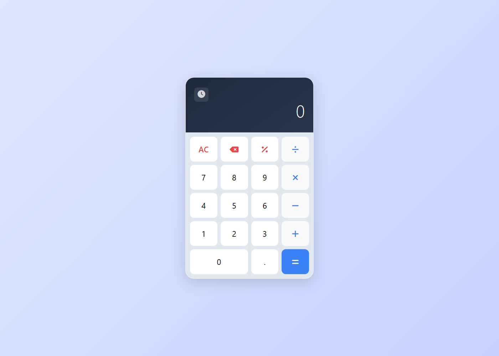
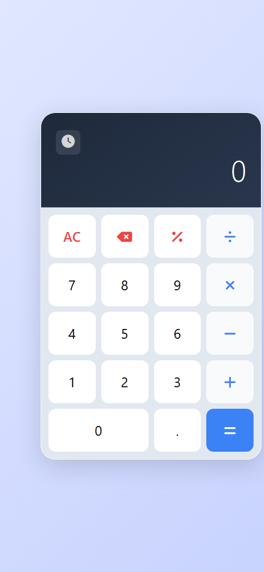

# 🧮 JavaScript Calculator

**JavaScript Calculator** is a **modern, responsive calculator web app** built with **vanilla HTML, CSS, and JavaScript**. It supports the core arithmetic operations, keeps a **persistent calculation history** in `localStorage`, and ships with a clean, card-style UI — making it a great reference project for learning DOM manipulation and event handling without any frameworks.

<p align="left">
  
  
  
  
</p>

## 📚 Table of Contents

- [Features](#-features)
- [Preview](#-preview)
- [Project Structure](#-project-structure)
- [Installation Guide](#️-installation-guide)
- [Technologies Used](#-technologies-used)
- [License](#-license)
- [Contributing](#-contributing)
- [Connect with Me](#-connect-with-me)

## ✨ Features

✅ **Core operations:** Addition, subtraction, multiplication, division, and percentage.
✅ **Calculation history:** Every result is saved to `localStorage`, so it survives a page reload.
✅ **Reusable history:** Click any past calculation to load it straight back into the display.
✅ **Manage history:** Delete a single entry or clear the entire history from the side panel.
✅ **Keyboard-friendly buttons:** Clear (`AC`), backspace, and percentage shortcuts for fast input.
✅ **Error handling:** Invalid expressions show a friendly `Error` message instead of crashing.
✅ **Responsive layout:** Looks great on desktop, tablet, and mobile screens.

## 👀 Preview

### 💻 Desktop


### 📱 Mobile


## 📂 Project Structure

```
javascript-calculator-app/
├── src/
│   ├── css/
│   │   └── styles.css       # Calculator layout, theme, and history panel styles
│   ├── js/
│   │   └── script.js        # Calculator logic, event handlers, and history storage
│   └── images/               # Screenshots used in this README
├── favicon.ico
├── index.html                 # App markup and entry point
└── README.md
```

## ⚙️ Installation Guide 🛠️

### 1️⃣ Clone the Repository 📥
```bash
git clone https://github.com/Iqbolshoh/javascript-calculator-app.git
```

### 2️⃣ Navigate to the Project Directory 📂
```bash
cd javascript-calculator-app
```

### 3️⃣ Open the App 🌐
Just open `index.html` in any modern browser — no build step or server required.

## 🖥 Technologies Used


## 📜 License
This project is open-source and available under the [MIT License](./LICENSE).

## 🤝 Contributing
🎯 Contributions are welcome! If you have suggestions or want to enhance the project, feel free to fork the repository and submit a pull request.

## 📬 Connect with Me
💬 I love meeting new people and discussing tech, business, and creative ideas. Let's connect! You can reach me on these platforms:

<div align="center">

[](https://iqbolshoh.uz)
[](mailto:iilhomjonov777@gmail.com)
[](https://github.com/iqbolshoh)
[](https://t.me/templates_uz_support)
[](https://wa.me/998776030033)
[](https://instagram.com/iqbolshoh.dev)
[](https://www.youtube.com/@Iqbolshoh_dev)

</div>
